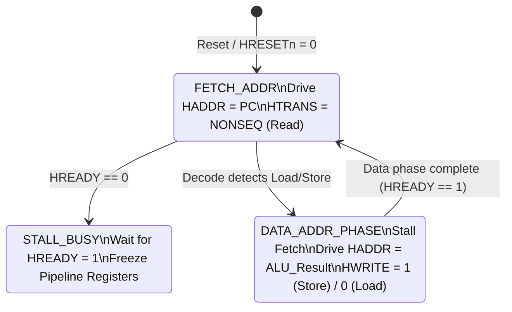

# Roadmap: Upgrading to an Industrial-Grade RISC-V CPU Core

This document details the hardware design changes, control logic, and architectural additions required to upgrade your 3-stage pipelined CPU from an educational toy RTL into an **industry-grade, physical silicon-ready RISC-V CPU core** natively supporting the **AHB-Lite** protocol.

---

## 1. Native AHB-Lite Master Interface (Option 2)

To interface directly with an industrial SoC bus matrix without an external wrapper, the CPU must natively manage the AHB-Lite protocol.

### AHB-Lite Bus Interface Signals
Add the following ports to your top-level CPU core:

```verilog
// Clock & Reset
input  wire        HCLK,
input  wire        HRESETn,

// AHB-Lite Master Signals
output reg  [31:0] HADDR,      // Transfer address
output reg  [1:0]  HTRANS,     // Transfer type (2'b00 = IDLE, 2'b10 = NONSEQ)
output reg         HWRITE,     // 1 = Write, 0 = Read
output reg  [2:0]  HSIZE,      // Transfer size (000=Byte, 001=Halfword, 010=Word)
output reg  [2:0]  HBURST,     // Burst type (3'b000 = SINGLE)
output reg  [3:0]  HPROT,      // Protection control (e.g., Data vs Instruction)
output reg  [31:0] HWDATA,     // Write data
input  wire [31:0] HRDATA,     // Read data
input  wire        HREADY,     // Transfer complete from active slave
input  wire        HRESP       // 0 = OKAY, 1 = ERROR
```

### The 2-Phase Pipelined Bus State Machine
Because AHB-Lite is a pipelined bus, the **Address Phase** of a load/store occurs during the **Execute (EX)** stage, while the **Data Phase** occurs in the next cycle. 

Here is the FSM logic that your core's bus controller must run:



### Pipeline Stall & Clock-Gating Logic
You must implement a centralized **Pipeline Control Unit** that stalls the pipeline stages. There are two distinct types of stalls:
1. **Bus-Wait Stall (Memory Latency):** If the memory is not ready (`HREADY == 0`), the entire pipeline ($IF, ID, EX$) must freeze.
2. **Structural Stall (Bus Conflict):** Because instruction and data share one AHB port, the $IF$ and $ID$ stages must freeze for 1 cycle during a load/store to allow the data address phase to occupy the bus.

```verilog
// Stall Detection Logic
wire bus_wait_stall = !HREADY;
wire bus_conflict_stall = (id_ex_instr_type == 4'b0001) || (id_ex_instr_type == 4'b0011); // Load or Store in EX

// Gated Clock-Enables for Pipeline Registers
wire pc_enable    = !bus_wait_stall && !bus_conflict_stall;
wire if_id_enable = !bus_wait_stall && !bus_conflict_stall;
wire id_ex_enable = !bus_wait_stall; // EX stage completes its address phase

// Apply to registers in RTL:
always @(posedge HCLK or negedge HRESETn) begin
    if (!HRESETn) begin
        if_id_instr <= 32'h00000013; // Reset to NOP (ADDI x0, x0, 0)
    end else if (if_id_enable) begin
        if_id_instr <= (jump || branch_taken) ? 32'h00000013 : HRDATA;
    end
end
```

---

## 2. Interrupt Controller & Exceptions (IRQ)

An industrial core must support asynchronous hardware interrupts (like timer ticks, SPI transfers, or I2S buffer events) and synchronous exceptions (like illegal instructions or misaligned memory addresses).

### Hardware Requirements
1. **Privilege Registers (CSRs - Control and Status Registers):**
   * `mstatus` (Machine Status): Tracks interrupt enable bits.
   * `mie` (Machine Interrupt Enable): Enables individual interrupt lines.
   * `mip` (Machine Interrupt Pending): Tracks which hardware lines are requesting interrupts.
   * `mtvec` (Machine Trap Vector): Stores the address of the Interrupt Service Routine (ISR).
   * `mepc` (Machine Exception Program Counter): Holds the PC to return to after processing the interrupt.
   * `mcause` (Machine Cause): Holds the identifier of the interrupt or exception.

2. **RTL Trap Controller Flow:**
   When an interrupt line (e.g., `ext_irq`) goes high and interrupts are enabled globally:
   * **Flush the Pipeline:** Clear $IF/ID$ and $ID/EX$ registers (convert to NOPs).
   * **Save State:** Copy the next PC to `mepc`, and write the code for `ext_irq` to `mcause`.
   * **Redirect PC:** Set `pc <= mtvec` to jump to the C handler.
   * **Return:** When the CPU decodes the `mret` instruction, it sets `pc <= mepc` and re-enables interrupts.

---

## 3. RISC-V Debug Module (DM)

For silicon verification and software debugging, an industrial core must support the **RISC-V Debug Specification (v0.13)** to communicate with tools like GDB and OpenOCD via JTAG.

### Architectural Requirements
```
 ┌──────────┐  JTAG   ┌───────────────┐  Debug Bus  ┌───────────────┐
 │ Debugger │────────▶│ Debug Transport│───────────▶│ Debug Module  │
 │ (OpenOCD)│         │  Module (DTM)  │            │     (DM)      │
 └──────────┘         └───────────────┘             └───────────────┘
                                                            │ Control
                                                            ▼
                                                    ┌───────────────┐
                                                    │   CPU Core    │
                                                    └───────────────┘
```

1. **Debug Mode:** A special execution state separate from Machine-Mode.
2. **Program Buffer:** A tiny scratchpad memory inside the DM. When the core halts, it executes instructions placed in this buffer by the debugger to read/write registers.
3. **Hardware Breakpoint Registers:** Registers that watch the PC or memory address bus and halt the core if a match occurs.
4. **Halt and Resume Request Lines:** Sideband wires between the Debug Module and the CPU pipeline to control the clock-gating of the Fetch stage.

---

## 4. Industry-Grade Memories (Moving Beyond `$readmemh`)

In physical silicon, you cannot use `$readmemh` to initialize memories, and you cannot use simple behavioral array registers (`reg [31:0] mem[255:0]`) because they do not synthesize into efficient silicon structures.

### 1. Physical SRAM Compiler IPs
In a real chip project, you compile memory macros using SRAM generators provided by the foundry (TSMC, UMC, GlobalFoundries). 
* Physical SRAMs are **synchronous read** (unlike your asynchronous toy RAM). The read address must be latched on a clock edge, and data is returned on the next clock edge.
* Upgrading to physical SRAM means your memory reads will take **1 clock cycle** of latency, requiring you to adjust your pipeline stages or introduce a read stall.

### 2. Dual-Porting ITCM and DTCM (The Bridge)
To make your Tightly-Coupled Memories (TCM) useful in an SoC, they must have **two access ports** (dual-ported memory):

```
                     ┌──────────────────┐
  CPU Fetch Stage ──▶│  ITCM Memory IP  │◀── AHB Bus Matrix (DMA Loading)
                     │ (Dual-Port SRAM) │
                     └──────────────────┘
```

* **Port A:** Connected directly to the CPU's fetch/load-store unit for single-cycle, zero-wait-state access.
* **Port B:** Connected to the AHB Bus Matrix. This allows the DMA controller or an external SPI master to write compiled program code into the ITCM, or read sensor logs out of the DTCM, without stalling the CPU.

### 3. The Bootloader Flow
To move on from simulator file loading, implement a real hardware boot flow:
1. **Boot ROM (Silicon ROM):** A small, hardcoded Read-Only Memory block implemented in structural standard cells containing a basic bootloader.
2. **Power-On Reset:** The CPU resets to address `0x0000_0000` (which points to the Boot ROM).
3. **SPI Flash Loading:** The Boot ROM bootloader initializes the SPI Master controller, reads the user C application binary from an external SPI Flash chip, and writes it into the **ITCM** and **DTCM** via Port B.
4. **Branch to App:** Once copying is complete, the bootloader executes a branch instruction to jump to the start of the ITCM (e.g. `jr x1` pointing to `0x3000_0000`), handing execution over to the C code.
