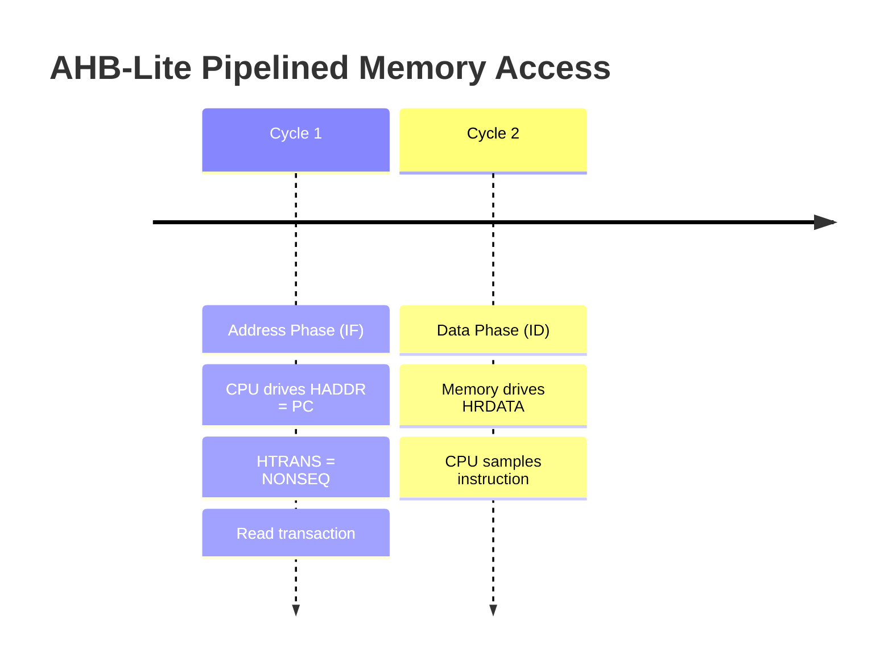

# NM32 Integration Analysis: Custom CPU as a PicoRV32 Replacement

This document outlines the architectural comparison between your **3-stage pipelined RISC-V (RV32IM) CPU** and the **PicoRV32 core** used in the `NM32_KAVACH` SoC (`/home/omkar/NM32_temp`). It also explains how to design a native **AHB-Lite Master interface** for your CPU and details what must be modified to make it a drop-in replacement.

---

## 1. Is AHB-Lite Possible in a 3-Stage Pipeline?

**Yes, it is entirely possible and highly standard.** Many commercial 2-stage and 3-stage processors (such as the ARM Cortex-M0/M3) natively use AHB-Lite. 

### How the Pipeline and AHB-Lite Align
AHB-Lite is a **pipelined bus protocol** consisting of two phases:
1. **Address Phase:** Lasts 1 clock cycle (driven by the master).
2. **Data Phase:** Lasts 1 or more clock cycles (sampled/driven by the master, ended when `HREADY` is high).

In a 3-stage pipeline ($IF \to ID \to EX/WB$), memory accesses align as follows:



* **Instruction Fetch (IF):** 
  * In the **IF stage**, the CPU drives the next PC as `HADDR`. This is the **Address Phase** of the instruction fetch.
  * In the **ID stage**, the instruction word is returned on `HRDATA`. This is the **Data Phase** of the fetch.
  * *Wait-States:* If `HREADY` is low, the pipeline must stall: the PC and `IF/ID` registers must hold their values.
* **Data Load/Store (EX/WB):**
  * When a load or store instruction enters the **EX stage**, the CPU drives `HADDR = alu_result` (Address Phase).
  * In the subsequent cycle, the CPU drives `HWDATA` (Store) or samples `HRDATA` (Load) (Data Phase).

---

## 2. The Shared Bus Bottleneck (Structural Hazard)

The `NM32_top` SoC has **only one shared AHB Master port** connected to the CPU. Since a single AHB port cannot execute two address phases at the same time:
* You **cannot** perform an instruction fetch in the IF stage while simultaneously executing a data load/store in the EX stage.
* **Resolution:** When a Load/Store instruction is in the EX stage, the CPU must stall the IF and ID stages for 1 cycle (generating a "bus conflict stall"). The master drives the load/store address on `HADDR` and sets `HTRANS` to `NONSEQ` for the data access, while postponing the next instruction fetch by driving `HTRANS = IDLE` in the subsequent cycle.

---

## 3. Custom CPU vs. PicoRV32 Comparison

| Feature | PicoRV32 | Custom CPU (Current Toy RTL) | Required Changes |
| :--- | :--- | :--- | :--- |
| **Instruction Set** | RV32IMC | RV32IM | **Compatible** (M-extension is already in RTL). |
| **Bus Interface** | Native Memory Interface (Pico Native) | Separate ROM (IF) and RAM (EX) ports (Harvard) | **Must be unified** into a single bus interface. |
| **Stall / Wait States** | Supported via `mem_ready` input | Not supported (assumes zero-wait-state memory) | **Pipeline stall logic** gated by `HREADY` must be added. |
| **Memory Addressing** | Byte-addressable | Word-addressable (RAM is indexed directly by word) | **Must implement byte-addressing** for RAM alignment. |
| **Bus Wrapper** | Handled externally by `pico_to_ahb` | None | See options below. |

---

## 4. Integration Roadmap: Two Options

To make your CPU a replacement for the Pico core in `NM32_top.sv`, you have two design paths:

### Option A: Implement Pico's Native Memory Interface (Recommended)
Instead of writing a complex AHB-Lite bus controller inside your CPU, you can expose the exact same native memory interface signals as PicoRV32:
* `mem_valid` (output): Assert when starting a fetch or load/store.
* `mem_ready` (input): Stall the pipeline if low; advance when high.
* `mem_addr` (output): Memory address (PC or ALU result).
* `mem_wdata` (output): Write data.
* `mem_wstrb` (output): 4-bit byte-write strobe (`4'b0001` for byte, `4'b1111` for word).
* `mem_instr` (output): `1` for instruction fetch, `0` for data.
* `mem_rdata` (input): Read data returned.

> [!TIP]
> **Why this is best:** You can drop your CPU directly into `NM32_top.sv` as a replacement for the `picorv32` instantiation, keeping the existing `pico_to_ahb` wrapper completely intact. This wrapper already handles the FSM, bus requests/grants (`hbusreq`/`hgrant`), and sizes (`HSIZE`).

### Option B: Native AHB-Lite Master Interface Inside the CPU
If you want the CPU to natively drive the AHB-Lite bus without the wrapper, you must implement the AHB-Lite protocol FSM inside your CPU controller:
1. **Bus Request:** Assert `mst_hbusreq` and wait for `mst_hgrant` from the arbiter.
2. **Address Phase:** Once granted, drive `HADDR`, `HTRANS = 2'b10 (NONSEQ)`, `HWRITE`, and `HSIZE` (byte, half-word, or word).
3. **Data Phase:** In the next cycle, drive `HWDATA` or sample `HRDATA` when `mst_hready_out == 1`.
4. **Stall Gating:** Gate the clock-enable (`en`) of all pipeline registers (PC, `IF/ID`, `ID/EX`) with `mst_hready_out`. If `mst_hready_out` is `0`, all registers must hold their states.

---

## 5. Required RTL Code Modifications

To make either option work, you must modify your CPU RTL in the following ways:

### 1. Unified Bus Port Multiplexing (Control Unit)
Modify `top_piplined.v` to multiplex between Instruction Fetch and Data Access.
* In a normal cycle, memory address `mem_addr = pc`, and `mem_instr = 1`.
* When a Load/Store instruction is in the `ID/EX` register, force `mem_addr = alu_result`, `mem_instr = 0`, and stall the IF stage.

### 2. Gated Pipeline Register Clocks (Stalls)
Currently, your pipeline registers advance on every clock edge:
```verilog
// Current
always @(posedge clk) begin
    if_id_instr <= instruction;
end
```
You must change this to only advance when the memory subsystem is ready:
```verilog
// Required
always @(posedge clk or negedge rst) begin
    if (!rst) begin
        if_id_instr <= 32'h00000000;
    end else if (mem_ready) begin  // Stalls the pipeline when mem_ready is low
        if_id_instr <= instruction;
    end
end
```

### 3. Implement Byte-Addressing and Load-Alignment
Your current memory interface indexes RAM by word. In the SoC, data memory accesses are byte-addressed.
* **Loads:** When loading bytes (`LB`/`LBU`) or half-words (`LH`/`LHU`), the CPU must check the lower 2 bits of the address and shift the returned data accordingly (e.g., if reading byte at address offset `3`, slice `mem_rdata[31:24]`).
* **Stores:** Generate `mem_wstrb` (or `HSIZE` and byte-aligned `HWDATA`) based on the write type (`SB`, `SH`, `SW`) and address alignment.
